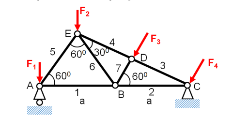

# Chương trình Phân tích tính toán Hệ Giàn Phẳng 2D

## Giới thiệu
Đây là ứng dụng web tương tác được phát triển bằng Python và Streamlit để phân tích các hệ giàn phẳng 2D. Chương trình cho phép người dùng xây dựng, phân tích và tính toán ứng lực trong các thanh của hệ giàn một cách trực quan và dễ dàng.

## Tính năng chính
1. **Giao diện tương tác:**
   - Thêm/xóa nút (nodes) với tọa độ (x,y)
   - Thêm/xóa thanh (bars) kết nối giữa các nút
   - Đặt gối tựa (pin hoặc roller) tại các nút
   - Thêm ngoại lực tác dụng lên các nút
   - Hiển thị trực quan hệ giàn

2. **Tính toán:**
   - Sử dụng phương pháp ma trận để giải hệ giàn
   - Tính toán ứng lực trong các thanh
   - Xác định phản lực tại các gối tựa
   - Kiểm tra tính ổn định của hệ

3. **Hiển thị kết quả:**
   - Biểu đồ hệ giàn với các thanh và nút
   - Hiển thị giá trị ứng lực trong từng thanh
   - Hiển thị phản lực tại các gối
   - Phân biệt thanh chịu kéo/nén bằng màu sắc

## Cấu trúc thư mục
```
LGH/
│
├── main.py               # File chính chứa giao diện người dùng
│
└── function/            # Thư mục chứa các module chức năng
    ├── solve_general_truss.py      # Module giải hệ giàn
    ├── calculate_bar_properties.py  # Tính toán đặc trưng của thanh
    └── plot_truss.py               # Module vẽ hệ giàn
```

## Yêu cầu hệ thống
- Python 3.7 trở lên
- Các thư viện Python:
  - streamlit
  - numpy
  - matplotlib
  - pandas (nếu cần xuất dữ liệu)

## Hướng dẫn cài đặt
1. Clone repository hoặc tải về máy
2. Cài đặt các thư viện cần thiết:
   ```bash
   pip install streamlit numpy matplotlib
   ```
3. Chạy chương trình:
   ```bash
   streamlit run main.py
   ```

## Cách sử dụng
1. **Thêm nút (Nodes):**
   - Nhập tên nút (ví dụ: A, B, C...)
   - Nhập tọa độ x, y
   - Nhấn "Thêm Nút"

2. **Thêm thanh (Bars):**
   - Chọn hai nút để kết nối
   - Nhấn "Thêm Thanh"

3. **Đặt gối tựa (Supports):**
   - Chọn nút cần đặt gối
   - Chọn loại gối (pin hoặc roller)
   - Nhấn "Đặt/Cập nhật Gối tựa"

4. **Thêm lực tác dụng:**
   - Chọn nút chịu lực
   - Nhập giá trị lực theo phương x và y
   - Nhấn "Thêm/Cập nhật Lực"

5. **Phân tích hệ:**
   - Nhấn "Giải Hệ Giàn" để tính toán
   - Xem kết quả ứng lực và phản lực

## Lưu ý quan trọng
- Đảm bảo hệ giàn ổn định trước khi tính toán
- Kiểm tra các điều kiện biên và lực tác dụng
- Chú ý đến đơn vị của lực và khoảng cách

## Xử lý lỗi thường gặp
1. **Hệ không ổn định:**
   - Kiểm tra số lượng và vị trí gối tựa
   - Đảm bảo kết cấu hệ giàn hợp lý

2. **Ma trận suy biến:**
   - Kiểm tra vị trí các thanh
   - Đảm bảo không có thanh trùng nhau

## Tác giả
- 2452391 - Lý Gia Huy

## Giấy phép
Dự án này được phát triển cho mục đích học tập và nghiên cứu.

## Phương pháp

### 1. Phương pháp tách nút (Method of Joints)

Phương pháp này dựa trên nguyên lý cân bằng tĩnh tại mỗi nút của hệ giàn. Tại mỗi nút, tổng các lực theo phương x và y phải bằng 0:

$\sum F_x = 0$ và $\sum F_y = 0$

### 2. Quy trình giải

#### Bước 1: Xác định các ẩn số

- Lực trong các thanh (S₁, S₂, ...)
- Phản lực tại các gối tựa (R_ax, R_ay, R_by, ...)

#### Bước 2: Thiết lập ma trận hệ số

Ma trận $A$ được xây dựng từ các hệ số của phương trình cân bằng:

- Hàng lẻ: phương trình $\sum F_x = 0$
- Hàng chẵn: phương trình $\sum F_y = 0$

Với mỗi thanh kết nối vào nút, hệ số được xác định bởi:

- $a_x = \cos(\theta)$ cho phương trình x
- $a_y = \sin(\theta)$ cho phương trình y

#### Bước 3: Thiết lập vector tải trọng

Vector $F$ chứa các thành phần của ngoại lực (dấu âm):
$F = \begin{bmatrix} -F_{1x} \\ -F_{1y} \\ -F_{2x} \\ -F_{2y} \\ \vdots \end{bmatrix}$

#### Bước 4: Giải hệ phương trình

$AX = F$ với:

- $A$: ma trận hệ số
- $X$: vector ẩn (ứng lực thanh và phản lực)
- $F$: vector tải trọng

## Ví dụ minh họa




## 2. Phương pháp giải

Phương pháp này dựa trên nguyên lý cân bằng tĩnh tại *mỗi nút* của hệ giàn. Tại mỗi nút, tổng các lực theo phương x và y phải bằng 0:
* $\sum F_x = 0$
* $\sum F_y = 0$

Chúng ta sẽ tuân theo quy trình 4 bước sau:

1.  **Xác định các ẩn số (Vector $X$):** Bao gồm nội lực trong các thanh ($S_1, S_2, \dots$) và các thành phần phản lực tại gối tựa ($A_x, A_y, C_y, \dots$).
2.  **Thiết lập ma trận hệ số (Ma trận $A$):** Ma trận $A$ chứa các hệ số $cos(\theta)$ và $sin(\theta)$ của các ẩn số trong mỗi phương trình cân bằng.
3.  **Thiết lập vector tải trọng (Vector $F$):** Vector $F$ chứa các thành phần của ngoại lực tác dụng tại mỗi nút (với dấu âm).
4.  **Giải hệ phương trình:** Giải hệ phương trình tuyến tính $AX = F$ để tìm vector ẩn $X$.

---

## 3. Phân tích chi tiết bài toán

### Bước 1: Xác định các ẩn số (Vector $X$)

1.  **Các nút (Nodes):** 5 nút (A, B, C, D, E).
2.  **Các thanh (Members):** 7 thanh (được đánh số 1 đến 7).
3.  **Các gối tựa (Supports):**
    * **Nút A:** Gối cố định (Pinned) $\implies$ 2 phản lực: $A_x$ và $A_y$.
    * **Nút C:** Gối di động (Roller) $\implies$ 1 phản lực: $C_y$ (vuông góc với mặt trượt).
4.  **Tổng số ẩn:**
    * 7 nội lực thanh: $S_1, S_2, S_3, S_4, S_5, S_6, S_7$.
    * 3 phản lực: $A_x, A_y, C_y$.
    * **Tổng cộng = 10 ẩn số.**

5.  **Tổng số phương trình:**
    * 5 nút $\times$ 2 phương trình (cân bằng $x$, $y$) = **10 phương trình.**

Do số ẩn = số phương trình, hệ giàn này là **tĩnh định**.

Vector ẩn $X$ (kích thước $10 \times 1$) được định nghĩa là:
$$
X = [S_1, S_2, S_3, S_4, S_5, S_6, S_7, A_x, A_y, C_y]^T
$$

### Bước 2: Phân tích Hình học (Tính góc)

Để lập ma trận $A$, chúng ta cần góc của mỗi thanh so với trục $x$ dương (đo ngược chiều kim đồng hồ). Dựa vào hình học của bài toán (với $AB = BC = a$):

* Tam giác ABE là tam giác đều (cạnh $a$, các góc $60^\circ$).
* Tọa độ các nút (giả sử $A = (0, 0)$ và $a=1$):
    * $A = (0, 0)$
    * $B = (1, 0)$
    * $C = (2, 0)$
    * $E = (0.5, \sqrt{3}/2)$
* Từ các góc đã cho, ta tìm được tọa độ nút D bằng cách giải giao điểm của 2 đường thẳng:
    * Đường thẳng BD (từ B, góc $60^\circ$): $y = \tan(60)(x - 1)$
    * Đường thẳng ED (từ E, góc $150^\circ$): $y - \sqrt{3}/2 = \tan(150)(x - 0.5)$
    * Giải hệ này cho ta $D = (1.25, \sqrt{3}/4)$.
* Từ đó, ta có góc của tất cả các thanh (góc $\theta$ mà lực trong thanh tác dụng *lên nút*):

| Nút | Thanh | Tác dụng từ nút | Góc (độ) |
| :--- | :--- | :--- | :--- |
| **A** | $S_1$ (AB) | A $\to$ B | $0^\circ$ |
| | $S_5$ (AE) | A $\to$ E | $60^\circ$ |
| **B** | $S_1$ (BA) | B $\to$ A | $180^\circ$ |
| | $S_2$ (BC) | B $\to$ C | $0^\circ$ |
| | $S_6$ (BE) | B $\to$ E | $120^\circ$ |
| | $S_7$ (BD) | B $\to$ D | $60^\circ$ |
| **C** | $S_2$ (CB) | C $\to$ B | $180^\circ$ |
| | $S_3$ (CD) | C $\to$ D | $150^\circ$ |
| **D** | $S_3$ (DC) | D $\to$ C | $330^\circ$ (hoặc $-30^\circ$) |
| | $S_4$ (DE) | D $\to$ E | $150^\circ$ |
| | $S_7$ (DB) | D $\to$ B | $240^\circ$ (hoặc $-120^\circ$) |
| **E** | $S_4$ (ED) | E $\to$ D | $330^\circ$ (hoặc $-30^\circ$) |
| | $S_5$ (EA) | E $\to$ A | $240^\circ$ (hoặc $-120^\circ$) |
| | $S_6$ (EB) | E $\to$ B | $300^\circ$ (hoặc $-60^\circ$) |

### Bước 3: Thiết lập Vector Tải trọng $F$ (Ví dụ)

Vector $F$ (kích thước $10 \times 1$) chứa **âm** của các thành phần ngoại lực.
$$
F = [-F_{Ax}, -F_{Ay}, -F_{Bx}, -F_{By}, -F_{Cx}, -F_{Cy}, -F_{Dx}, -F_{Dy}, -F_{Ex}, -F_{Ey}]^T
$$

**Giả sử ta có các lực ví dụ (theo yêu cầu của bạn):**
* $F_1$ (tại A): $10 \text{ kN}$ hướng xuống $\implies F_{Ax} = 0, F_{Ay} = -10$
* $F_2$ (tại E): $20 \text{ kN}$ hướng xuống $\implies F_{Ex} = 0, F_{Ey} = -20$
* $F_3$ (tại D): $15 \text{ kN}$ hướng xuống $\implies F_{Dx} = 0, F_{Dy} = -15$
* $F_4$ (tại C): $5 \text{ kN}$ hướng xuống $\implies F_{Cx} = 0, F_{Cy} = -5$

**Lưu ý:** Lực $F_3$ trong hình có vẻ xiên. Nếu nó xiên (ví dụ, ở góc $240^\circ$), bạn cần phân tích nó thành các thành phần $x$ và $y$. Ví dụ, nếu $F_3 = 15 \text{ kN}$ tại $240^\circ$:
$F_{Dx} = 15 \cdot \cos(240^\circ) = -7.5 \text{ kN}$
$F_{Dy} = 15 \cdot \sin(240^\circ) \approx -13.0 \text{ kN}$

Nhưng để đơn giản, ví dụ này giả định tất cả các lực đều thẳng đứng.

Với các lực thẳng đứng ví dụ trên, **Vector $F$** trở thành:
* Nút A (Eq 1, 2): $-F_{Ax} = 0$, $-F_{Ay} = 10$
* Nút B (Eq 3, 4): $-F_{Bx} = 0$, $-F_{By} = 0$
* Nút C (Eq 5, 6): $-F_{Cx} = 0$, $-F_{Cy} = 5$
* Nút D (Eq 7, 8): $-F_{Dx} = 0$, $-F_{Dy} = 15$
* Nút E (Eq 9, 10): $-F_{Ex} = 0$, $-F_{Ey} = 20$

$$
F = [0, 10, 0, 0, 0, 5, 0, 15, 0, 20]^T
$$

### Bước 4: Thiết lập Ma trận Hệ số $A$

Ma trận $A$ (kích thước $10 \times 10$) được xây dựng từ các phương trình cân bằng tại mỗi nút.

* Hàng 1 (Nút A, $\sum F_x$): $S_1\cos(0) + S_5\cos(60) + A_x = -F_{Ax}$
* Hàng 2 (Nút A, $\sum F_y$): $S_1\sin(0) + S_5\sin(60) + A_y = -F_{Ay}$
* Hàng 3 (Nút B, $\sum F_x$): $S_1\cos(180) + S_2\cos(0) + S_6\cos(120) + S_7\cos(60) = -F_{Bx}$
* Hàng 4 (Nút B, $\sum F_y$): $S_1\sin(180) + S_2\sin(0) + S_6\sin(120) + S_7\sin(60) = -F_{By}$
* Hàng 5 (Nút C, $\sum F_x$): $S_2\cos(180) + S_3\cos(150) = -F_{Cx}$
* Hàng 6 (Nút C, $\sum F_y$): $S_2\sin(180) + S_3\sin(150) + C_y = -F_{Cy}$
* Hàng 7 (Nút D, $\sum F_x$): $S_3\cos(330) + S_4\cos(150) + S_7\cos(240) = -F_{Dx}$
* Hàng 8 (Nút D, $\sum F_y$): $S_3\sin(330) + S_4\sin(150) + S_7\sin(240) = -F_{Dy}$
* Hàng 9 (Nút E, $\sum F_x$): $S_4\cos(330) + S_5\cos(240) + S_6\cos(300) = -F_{Ex}$
* Hàng 10 (Nút E, $\sum F_y$): $S_4\sin(330) + S_5\sin(240) + S_6\sin(300) = -F_{Ey}$

### Bước 5: Giải hệ phương trình $AX = F$

Thay các giá trị $cos$ và $sin$ vào, ta có ma trận $A$ hoàn chỉnh.

**Ma trận $A$ ($10 \times 10$):**
(Cột tương ứng với: $S_1, S_2, S_3, S_4, S_5, S_6, S_7, A_x, A_y, C_y$)

## Liên hệ
Nếu có bất kỳ câu hỏi hoặc góp ý, vui lòng liên hệ qua email hoặc tạo issue trên repository.